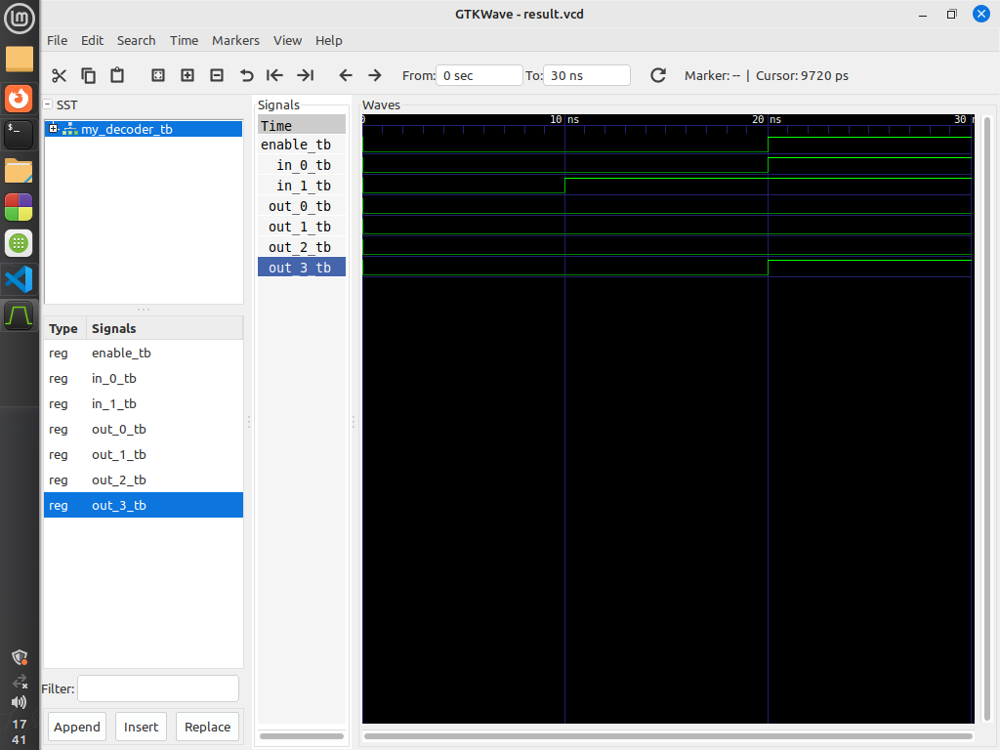

# Design and Write a VHDL Code for Decoder

This repository contains VHDL code for a Decoder (`my_decoder`) and a corresponding test bench (`my_decoder_tb`) for simulation and verification.

## Entities

### `my_decoder`

The `my_decoder` entity represents a decoder.

#### Ports

- `in_1`: Input signal for the first input.
- `in_0`: Input signal for the second input.
- `enable`: Enable signal to activate the decoder.
- `out_3`: Output signal for the decoded value (bit 3).
- `out_2`: Output signal for the decoded value (bit 2).
- `out_1`: Output signal for the decoded value (bit 1).
- `out_0`: Output signal for the decoded value (bit 0).

### `my_decoder_tb`

The `my_decoder_tb` entity is a test bench for the `my_decoder` entity.

## Block Diagram


## Test Cases

### Test Case 1: 

- **Input:** `in_1 = '0'`, `in_0 = '0'`, `enable = '0'`.
- **Expected Output:** All output signals (`out_3`, `out_2`, `out_1`, `out_0`) should be `'0'`.

### Test Case 2: 

- **Input:** `in_1 = '1'`, `in_0 = '1'`, `enable = '1'`.
- **Expected Output:** `out_3 = '1'`, `out_2 = '0'`, `out_1 = '0'`, `out_0 = '0'`.


## Simulation

To compile and run the simulation, execute the following commands:

```bash
make

## Output Diagram


