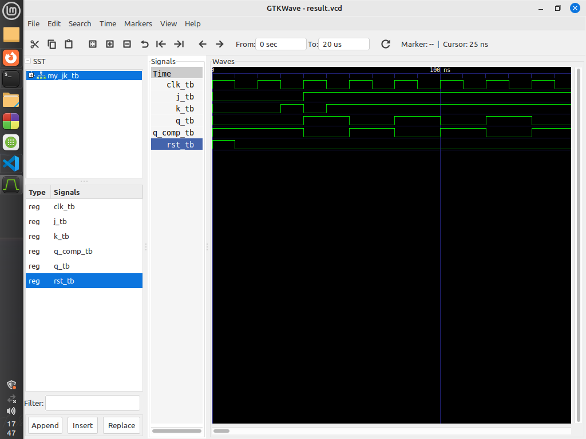

# VHDL Project: Entities and Test Cases

This repository contains VHDL code for several entities and their corresponding test benches, along with descriptions of the entities, test cases, and diagrams.

## Entities

### 1. `my_jk` Entity

The `my_jk` entity represents a JK flip-flop with asynchronous reset and synchronous clock.

#### Ports

- `j`: Input signal for J.
- `k`: Input signal for K.
- `clk`: Clock input.
- `rst`: Asynchronous reset input.
- `q`: Output signal.
- `q_comp`: Complementary output signal.

### 2. `my_jk_tb` Entity

The my_jk_tb entity is a test bench for the my_jk_tb entity.

## Test Cases

### Test Case 1: Asynchronous Reset

- **Description:** Verify the functionality of asynchronous reset.
- **Procedure:** Apply reset (`rst = '1'`), then release reset (`rst = '0'`), and observe output behavior.
- **Expected Result:** Output should be cleared when the reset is active.

### Test Case 2: Basic Flip-Flop Behavior

- **Description:** Verify basic flip-flop behavior with various input combinations.
- **Procedure:** Apply different combinations of J and K inputs, and observe output behavior.
- **Expected Result:** Output should follow the JK flip-flop truth table.

## State Diagram

## Output Diagram

The output diagram depicts the behavior of the JK flip-flop in response to different input stimuli. It illustrates how the output signals (`q` and `q_comp`) change over time under various test cases.
