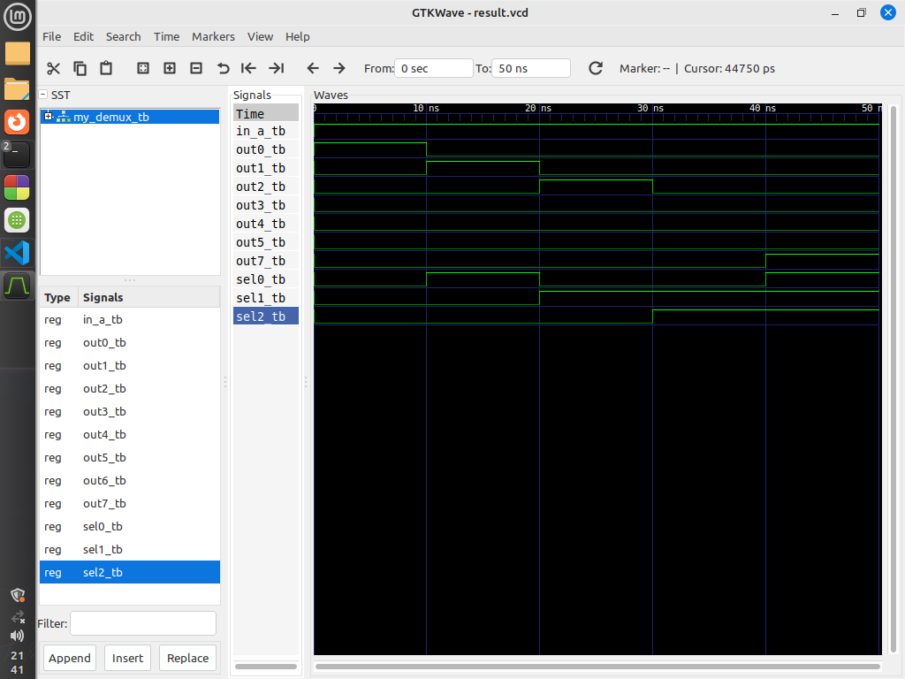

# VHDL Project: Demultiplexer (DEMUX)

This repository contains VHDL code for a Demultiplexer (`my_demux`) and its corresponding test bench (`my_demux_tb`). The demultiplexer takes one input (`in_a`) and selects one of the eight output signals (`out7` to `out0`) based on the three select signals (`sel2`, `sel1`, `sel0`).

## Entities

### 1. `my_demux`

The `my_demux` entity represents a Demultiplexer with one input and eight outputs.

#### Ports

- `in_a`: Input signal.
- `sel2`, `sel1`, `sel0`: Select signals.
- `out7` to `out0`: Output signals.

### 2. `my_demux_tb`

The `my_demux_tb` entity is a test bench for the `my_demux` entity.

## Test Cases

### Test Case 1: 

- **Input:** `in_a = '1'`, `sel0 = '1'`, `sel1 = '0', `sel2 = '0'`.
- **Expected Output:** out_0 = '1'`, `out_1 = '0'`, `out_2 = '0'`, `out_3 = '0', out_4 = '0'`, `out_5 = '0'`, `out_6 = '0'`, `out_7 = '0'`.

### Test Case 2: 

- **Input:** `in_a = '1'`, `sel0 = '0'`, `sel1 = '1', `sel2 = '0'`.
- **Expected Output:** out_0 = '0'`, `out_1 = '1'`, `out_2 = '0'`, `out_3 = '0', out_4 = '0'`, `out_5 = '0'`, `out_6 = '0'`, `out_7 = '0'`.

### Test Case 3: 

- **Input:** `in_a = '1'`, `sel0 = '0'`, `sel1 = '1, `sel2 = '1'`.
- **Expected Output:** out_0 = '1'`, `out_1 = '0'`, `out_2 = '0'`, `out_3 = '1', out_4 = '0'`, `out_5 = '0'`, `out_6 = '0'`, `out_7 = '0'`.

### Test Case 4: 

- **Input:** `in_a = '1'`, `sel0 = '1'`, `sel1 = '1', `sel2 = '1'`.
- **Expected Output:** out_0 = '1'`, `out_1 = '0'`, `out_2 = '0'`, `out_3 = '0', out_4 = '0'`, `out_5 = '0'`, `out_6 = '0'`, `out_7 = '1'`.

## Block Diagram

The block diagram illustrates the internal structure of the Demultiplexer (`my_demux`). It shows the input port (`in_a`) and the eight output ports (`out7` to `out0`), as well as the select signals (`sel2`, `sel1`, `sel0`).

## Output Diagram

The output diagram depicts the behavior of the Demultiplexer in response to different input stimuli. It illustrates how the output signals change over time under various test cases.
