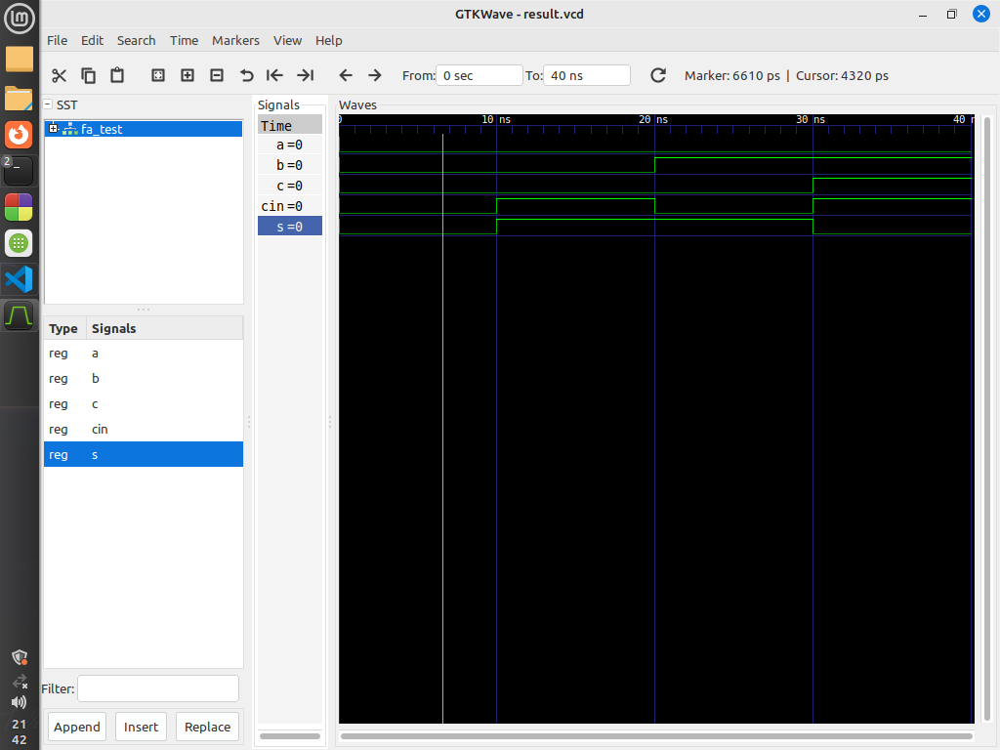

# Write a code in VHDL to implement full adder.

This repository contains VHDL code for implementing a Full Adder using two Half Adders and an OR gate, along with a corresponding test bench.

## Entities

### `or_gate`

The `or_gate` entity represents a basic OR gate.

#### Ports

- `x`: Input signal.
- `y`: Input signal.
- `z`: Output signal.

### `half_adder`

The `half_adder` entity represents a Half Adder.

#### Ports

- `a`: Input signal.
- `b`: Input signal.
- `s`: Sum output signal.
- `c`: Carry output signal.

### `full_adder`

The `full_adder` entity represents a Full Adder implemented using two Half Adders and an OR gate.

#### Ports

- `A`: Input signal.
- `B`: Input signal.
- `Cin`: Input carry signal.
- `S`: Sum output signal.
- `C`: Carry output signal.

## Test Cases

### Test Case 1: 

- **Input:** `A = '0'`, `B = '0'`, `Cin = '0'`.
- **Expected Output:** `S = '0'`, `C = '0'`.

### Test Case 2: 

- **Input:** `A = '1'`, `B = '0'`, `Cin = '1'`.
- **Expected Output:** `S = '1'`, `C = '0'`.

### Test Case 3: 

- **Input:** `A = '0'`, `B = '1'`, `Cin = '0'`.
- **Expected Output:** `S = '1'`, `C = '0'`.

### Test Case 4: 

- **Input:** `A = '0'`, `B = '1'`, `Cin = '1'`.
- **Expected Output:** `S = '0'`, `C = '1'`.

  
## Block Diagram

The block diagram illustrates the internal structure of the Full Adder, which consists of two Half Adders and an OR gate.

## Output Diagram

The output diagram depicts the behavior of the Full Adder in response to different input stimuli. It illustrates how the Sum and Carry output signals change over time under various test cases.
