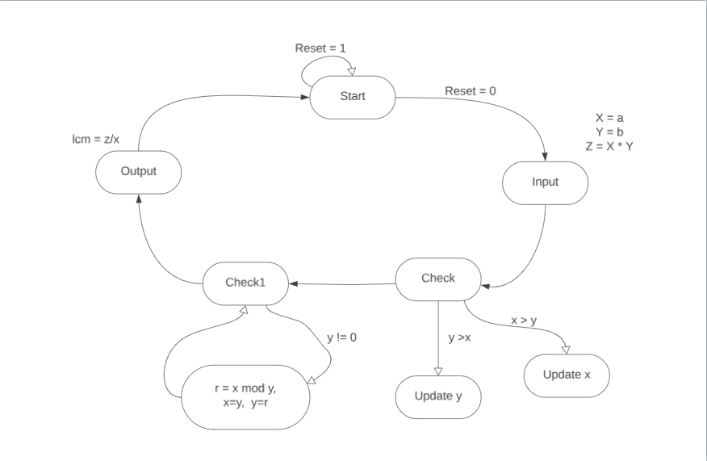
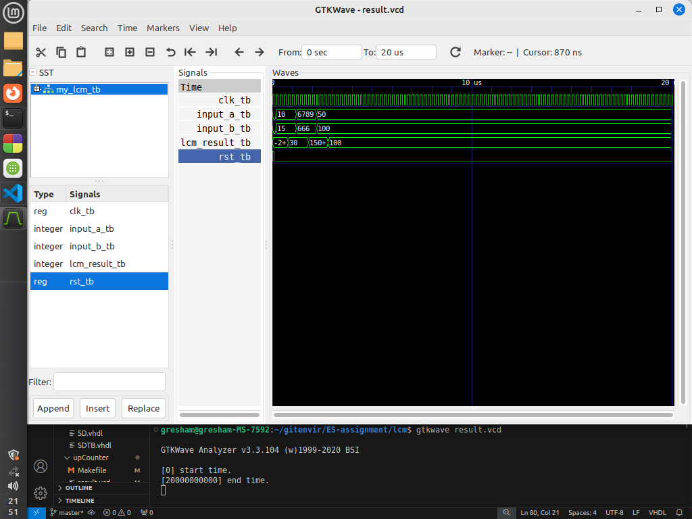

# Write a code in VHDL to find the LCM of two numbers.

This repository contains VHDL code for an LCM (Least Common Multiple) calculator (`my_lcm`) and its corresponding test bench (`my_lcm_tb`). The calculator determines the least common multiple of two input integers (`input_a` and `input_b`) using the Euclidean algorithm.

## Entities

### `my_lcm`

The `my_lcm` entity represents an LCM calculator.

#### Ports

- `rst`: Reset signal.
- `clk`: Clock signal.
- `input_a`: Input integer.
- `input_b`: Input integer.
- `lcm_result`: Output integer representing the least common multiple.

## Test Cases

### Test Case 1: 

- **Input:** `input_a = '10'`, `input_b = '15'`.
- **Expected Output:** `lcm_result = '30'`.

### Test Case 2: 

- **Input:** `input_a = '6789'`, `input_b = '666'`.
- **Expected Output:** `lcm_result = '1507158'`.

### Test Case 3: 

- **Input:** `input_a = '10'`, `input_b = '15'`.
- **Expected Output:** `lcm_result = '100'`.

## Algorithm

-  **Step 1:** Let `x, y` be the two numbers.
-  **Step 2:** Calculate `z = x * y`.
-  **Step 2:** IF `x` < `y`. Then `Swap`.
-  **Step 3:** IF `y=0`. Goto step 5.
               ELSE `r= x mod y`
                    `x = y` and `y = r`
               END IF
-  **Step 4:** Repeat step 3 until `y > 0`.
-  **Step 5:** `GCD = x`.
-  **Step 6:** Output `LCM = z / GCD`
-  **Step 6:** END

## State Diagram

## Output Diagram

The output diagram depicts the behavior of the LCM calculator in response to different input stimuli. It illustrates how the output least common multiple changes over time under various test cases.
