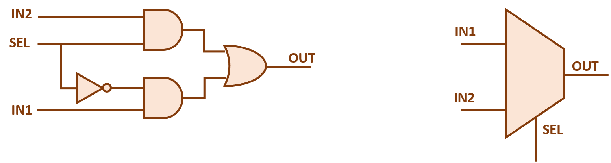
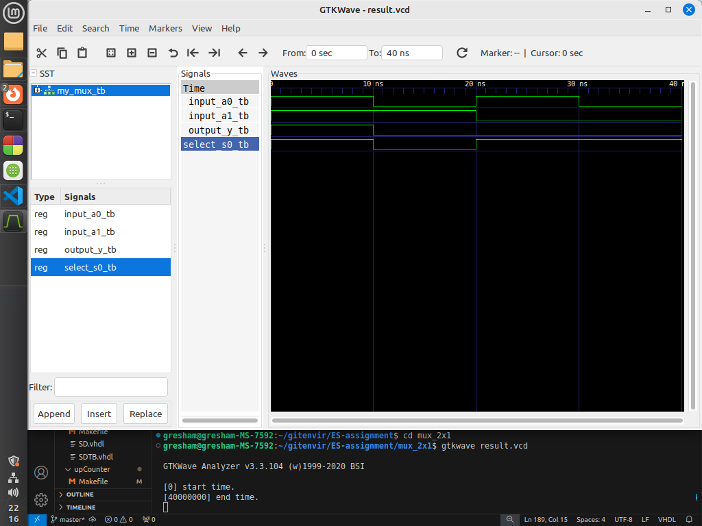

# Write VHDL code for 2-input multiplexer.

This repository contains VHDL code for a 2-to-1 multiplexer (`my_mux`) and its corresponding test bench (`my_mux_tb`). The multiplexer selects one of two input signals (`input_a0` and `input_a1`) based on the value of the select signal (`select_s0`) and outputs the selected signal on `output_y`.

## Entities

### `my_mux`

The `my_mux` entity represents a 2-to-1 multiplexer.

#### Ports

- `input_a0`: Input signal 0.
- `input_a1`: Input signal 1.
- `select_s0`: Select signal for choosing between input signals.
- `output_y`: Output signal representing the selected input signal.

## Test Cases

### Test Case 1: 

- **Input:** `input_a0 = '1'`, `input_a1 = '1'`, `select_s0 = '1'`.
- **Expected Output:** `output_y = '1'`.

### Test Case 2: 

- **Input:** `input_a0 = '0'`, `input_a1 = '1'`, `select_s0 = '0'`.
- **Expected Output:** `output_y = '0'`.

### Test Case 3: 

- **Input:** `input_a0 = '1'`, `input_a1 = '0'`, `select_s0 = '1'`.
- **Expected Output:** `output_y = '0'`.

### Test Case 4:

- **Input:** `input_a0 = '0'`, `input_a1 = '0'`, `select_s0 = '1'`.
- **Expected Output:** `output_y = '0'`.
 
## Block Diagram

The block diagram illustrates the internal structure of the 2-to-1 multiplexer (`my_mux`). It shows how the input signals and select signal are processed to determine the output signal.

## Output Diagram

The output diagram depicts the behavior of the multiplexer in response to different input stimuli and select signal values. It illustrates how the output signal changes based on the selected input signal.
