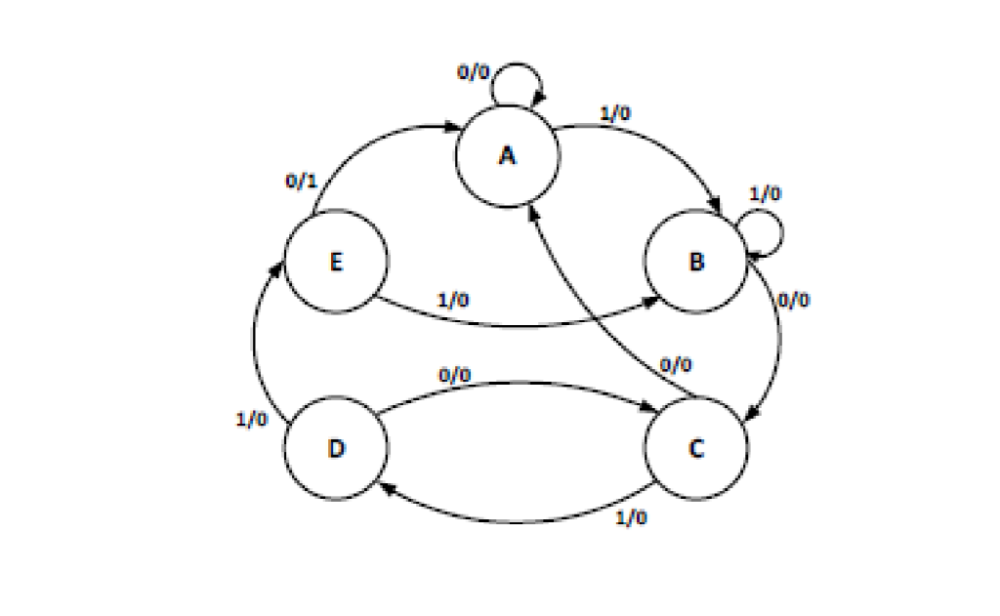
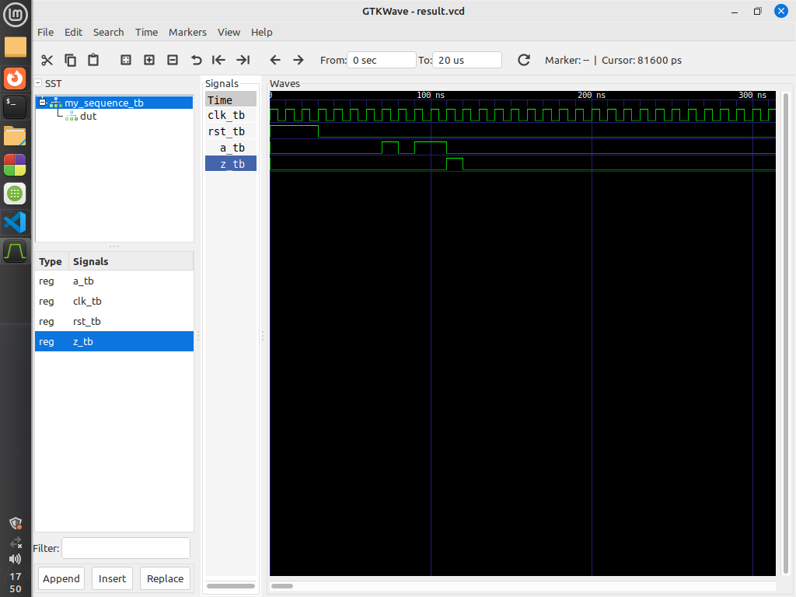

# Design a sequence detector for the string "1101" that outputs when a one when the input matches this string. 

This repository contains VHDL code for a sequence detector (`my_sequence`) and its corresponding test bench (`my_sequence_tb`). The sequence detector detects a specific sequence of input signals (`a`) and generates an output signal (`z`) when the sequence is detected.

## Entities

### `my_sequence`

The `my_sequence` entity represents a sequence detector that detects a specific sequence of input signals and generates an output signal accordingly.

#### Ports

- `clk`: Clock signal for synchronization.
- `rst`: Reset signal for resetting the detector.
- `a`: Input signal representing the sequence to be detected.
- `z`: Output signal indicating whether the sequence is detected.

## Test Cases

### Test Case 1: 

- **Input:** `a = '0'`.
- **Expected Output:** `z= '0'

- ### Test Case 1: 

- **Input:** `a = '0'`.
- **Expected Output:** `z= '0'
### Test Case 2: 

- **Input:** `a = '1'`.
- **Expected Output:** `z= '0'`.

### Test Case 3: 

- **Input:** `a = '0'`.
- **Expected Output:** `z= '0'.

### Test Case 4: 

- **Input:** `a = '1'`.
- **Expected Output:** `z= '0'

### Test Case 5: 

- **Input:** `a = '1'`.
- **Expected Output:** `z= '1'
 
## State Diagram

The block diagram illustrates the internal structure of the sequence detector (`my_sequence`). It shows how the input signals are processed to detect the specified sequence and generate the output signal accordingly.

## Output Diagram

