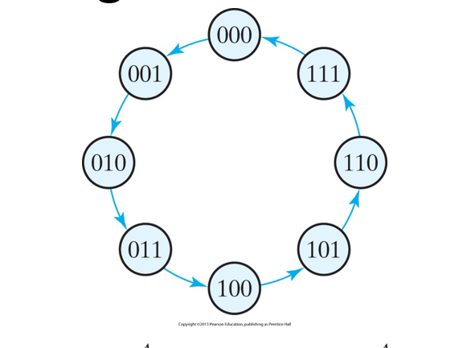
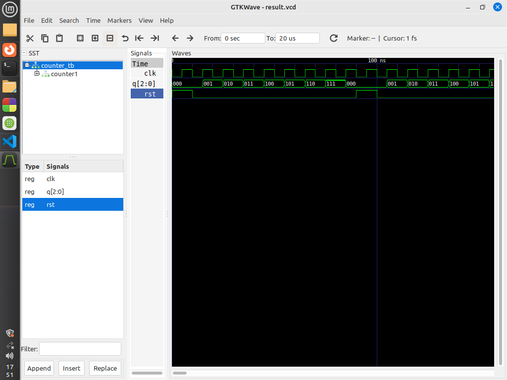

# Write VHDL code for Up Counter.

This repository contains VHDL code for an up counter implemented using T flip-flops and AND gates. It consists of three main entities: `T_flipflop`, `AND_G`, and `up_counter`.

## Entities

### `T_flipflop`

The `T_flipflop` entity represents a T flip-flop with asynchronous reset.

#### Ports

- `T`: Input signal for toggling the flip-flop.
- `CLK`: Clock signal for synchronization.
- `RST`: Asynchronous reset signal.
- `Q`: Output signal representing the state of the flip-flop.

### `AND_G`

The `AND_G` entity represents an AND gate.

#### Ports

- `A`, `B`: Input signals to be ANDed.
- `Z`: Output signal representing the result of the AND operation.

### `up_counter`

The `up_counter` entity represents the up counter composed of T flip-flops and AND gates.

#### Ports

- `CLK`: Clock signal for synchronization.
- `RST`: Asynchronous reset signal.
- `Q`: Output signal representing the count value as a 3-bit vector.

## Test Cases

### Test Case 1: Basic Functionality Test

- **Description:** Verify the basic functionality of the up counter.
- **Procedure:** Apply clock pulses and observe the count value.
- **Expected Result:** The count value should increment by 1 for each clock pulse.

### Test Case 2: Reset Test

- **Description:** Test the behavior of the up counter upon reset.
- **Procedure:** Assert and deassert the reset signal and observe the count value.
- **Expected Result:** Upon reset, the count value should return to 0.

## State Diagram

## Block Diagram

The block diagram illustrates the internal structure of the up counter, showing how T flip-flops and AND gates are interconnected to form the counter.

## Output Diagram

The output diagram depicts the behavior of the up counter in response to clock pulses. It shows how the count value changes over time.
